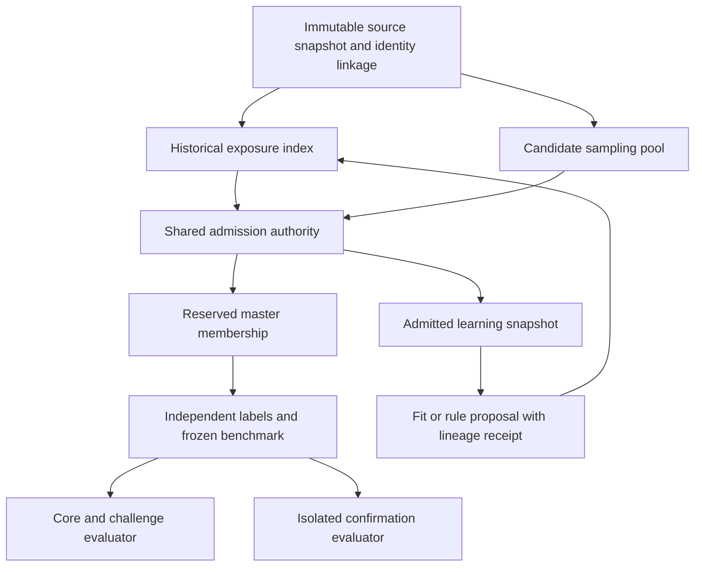

# Transaction categorisation master benchmark — v1 design

Status: **designed for implementation; no dataset created and no enforcement deployed**.
Design date: 15 September 2026. Requested by Carlos. Proposed benchmark identity:
`txncat-master`, first frozen version `1.0.0`. This is a data-governance and evaluation
design, not a change to categorisation behaviour or permission to consume locked v6.

Companion documents: [identity and data contract](DATA_CONTRACT.md),
[implementation and acceptance plan](IMPLEMENTATION_PLAN.md),
[machine-readable design](benchmark-plan.json), [acceptance scenarios](acceptance-cases.json).
The [coverage audit](audit/REPORT.md) and [counts](audit/coverage.json) explain the gaps.

## 1. Decisions

1. Keep one governed master benchmark with distinct **repeatable core**, **targeted
   challenge** and **sealed confirmation** partitions. Training and tuning-validation
   are separate assets, never partitions that benchmark rows can later move into.
2. Reserve evaluation membership **before labelling or model inspection**. Membership
   survives copies, renamed files, new extracts, repeat reports, label corrections,
   failed labelling and retirement. No automatic evaluation-to-training transition.
3. Identify examples using source event identity, linked customer/account identities,
   and versioned fingerprints of actual model inputs. A filename, split column or
   merchant string alone is insufficient. Blank merchants remain supported.
4. Every learning/data-enrichment consumer uses the same admission gate, including
   domain pretraining, distillation and tokenizer/vectorizer fitting. Model and
   rule/dictionary artefacts require verifiable lineage receipts before promotion.
5. A fresh benchmark must pass a historical exposure audit. A future transaction
   date or a new transaction ID does not prove a new model input. Unknown historical
   exposure stays unknown; it cannot be converted into a clean certificate.
6. All existing exclusions and locked-set restrictions survive migration. The new
   policy may distinguish representative and novel-family cohorts without weakening
   the old registry's merchant/family exclusions.

## 2. What “unseen” means

Record separate assertions, rather than one misleading `is_test` flag:

| Assertion | Required evidence |
|---|---|
| Event not used for learning | Stable event/alias identities absent from all registered learning inputs and ancestors |
| Customer group isolated | No linked customer/account group shared between master partitions or controlled training/tuning inputs |
| Model input not used for learning | No match under any applicable historical/current model-input projection, including MLM sentences and token truncation |
| Novel merchant family | Reviewed family absent from learning and dictionary/rule development sources; required only in the novelty cohort |
| Unused for selection | No previous inspection or feedback-driven choice using the sealed partition |

**Release default:** master-v1 members require verified event and applicable input
non-exposure in Raylo-controlled lineage. Customer isolation is mandatory going
forward; historical isolation must be established by source linkage or a defensible
new-customer cohort after the exposure cutoff. Inability to recover identities is
not evidence of independence. Third-party base-model pretraining is separately
recorded as outside our verifiable Raylo lineage; do not claim universal non-exposure.

A known merchant may legitimately appear: a new Waitrose transaction is not a
novel-family test. Its specific learning input and source evidence must still be
unseen. The baseline dictionary may already know Waitrose; existing general business
knowledge is not itself transaction-label leakage. New rule/dictionary evidence
must not originate in the reserved benchmark.

**Representation trade-off:** strict projection exclusion can remove common recurring
inputs, particularly short blank-merchant narratives. Report eligibility and rejection
rates by traffic stratum. The core estimates the **unseen-eligible population**, not
all traffic, unless coverage supports that stronger claim. Weighting cannot repair
strata with zero inclusion probability. If exclusions leave a material gap, explicitly
add a separately named known-input diagnostic outside the strict master or gather
more eligible data; never silently admit seen inputs to achieve the quota.

Repeatedly inspected core/challenge results are development feedback, even though
their rows remain barred from training. Sealed confirmation is the independent
release check. This distinction follows the established problem of adaptive holdout
reuse ([Dwork et al.](https://proceedings.neurips.cc/paper/2015/hash/bad5f33780c42f2588878a9d07405083-Abstract.html)).

## 3. Population, sampling and size

Initial envelope: **20,000 labelled eligible transactions**, subject to observed
coverage, labelling effort and paired-test power. Do not silently reduce coverage
targets to fit that envelope.

| Partition | Initial target | Use |
|---|---:|---|
| core | 10,000 | Repeat every behavioural change; probability sample of eligible Plaid service traffic |
| challenge | 5,000 | Repeat every change; additional independent examples for critical/rare categories and difficult inputs |
| confirmation | 5,000 | Sealed: 4,000 representative + 1,000 critical challenge examples, reported separately |

Current API launch scope is Plaid. Equifax remains a separately labelled legacy
research evaluation; never blend it into the launch headline. Profile the intended
assessment population first: source tables, application eligibility, account types,
banks, GBP/other currencies, pending status, time coverage and repeat-report frequency.
Do not invent production proportions from our old evaluation samples.

Sample a prospectively defined period after all relevant Raylo learning extracts,
preferably spanning at least two complete monthly pay/bill cycles when available.
If only a shorter window exists, publish that limitation and postpone seasonal claims.
Freeze exact date bounds before selecting records; do not use a moving “last 30 days”.
Prefer new linked customer groups where historical customer isolation is provable.

Build partition blocks before assignment: linked customers are indivisible, and
customers sharing an exact applicable effective input belong in the same sampling
block. This statistical grouping does not assert they are the same person/event.
Use deterministic keyed random block assignment to establish disjoint pools, then
probability-sample transactions within pools. Retain inclusion probabilities and
inverse-probability weights. The sampling key is independent from identity keys and
fixed per version. Keep repeat reports and pending/posted aliases in one event family.
Measure large connected blocks caused by generic narratives; declare any exclusions
before sampling and include their loss in the eligible-population report. Do not
resolve cross-pool overlaps by arbitrary arrival order after sampling.

Sampling multiple transactions per customer is allowed and needs customer/block-aware
uncertainty; account for any per-customer cap in the selection probabilities. Do not
silently give a 500-transaction customer the same weight as a five-transaction customer
for a transaction-weighted headline. Later observations that bridge frozen blocks
are quarantined for review; existing partitions are never silently reassigned.

Core and confirmation representative samples retain the measured mixes of:
credit/debit/zero amount; blank, filled and misleading merchant; informative/generic/
truncated/missing narrative; amount bands; bank/account type; provider-category
availability; currency and pending status supported by the app. Exclusions and
unsupported inputs are counted against the source population, not made invisible.

### Challenge coverage

`benchmark-plan.json` names the critical leaves (validated against the current
275-leaf taxonomy). Initial goal: **200 examples per critical leaf across core plus
challenge**, with meaningful support in each important input condition. Obtain
examples from multiple customer groups and counterparties; 200 copies of one payroll
memo are not 200 independent tests. Where attainable, aim for at least 30 customer
groups and ten counterparty families for a critical leaf. Report concentration and
exceptions; do not invent family identities for blank merchants.

Cover all 29 general categories. Aim for at least 20 independently labelled examples
per applicable leaf across the regular benchmark; 20 is a coverage floor, not a
precise accuracy estimate. Critical leaves have the higher target. Truly unavailable
leaves are marked `unsupported_insufficient_evidence`, with counts and an explicit
release implication. No fabricated synthetic examples satisfy real-data quotas.

Targeted conditions include retailer refunds/payroll/ambiguous credits, returned
DD/SO, reversals, card-issuer credits vs repayments, overdrafts, gambling credits vs
spend, transfer rails vs actual purpose, same-merchant product collisions, and
novel families. Include both directions where semantically applicable. Set minimum
filled/blank support for applicable critical leaves after the source profile, before
candidate scores; do not demand physically implausible combinations.

Candidate-independent discovery may use fixed source attributes, provider labels
as sampling proxies and a frozen search rubric. Final human labels determine actual
coverage. Sample additional challenge batches to meet predeclared gaps; freeze the
regular benchmark before evaluating the first candidate. Never alter core membership
to balance labels after seeing model errors. Keep all selection/exclusion probabilities
and distinguish fixed synthetic regression fixtures from empirical data.

## 4. Labelling and quality

Reserve the pool first, then present only prediction-time fields to two independent
human reviewers. Hide our engine prediction, candidate identity, partition and the
other reviewer's answer. Normal app input fields such as provider category can be
shown consistently; do not reveal later information unavailable to the engine.
Use the frozen taxonomy and a versioned label guide based on existing conventions.
LLMs may assist workflow outside the sealed partition, but their votes are not gold;
a reviewer should make an independent judgement before seeing an LLM suggestion.

Disagreements go to a separate domain adjudicator. Record original votes, adjudication,
reason code, permitted evidence and label-guide version. Freeze newly required
conventions before applying them consistently to all affected labels. Do not reuse
these benchmark narratives as worked examples for labelling training data.

Label outcomes:
- `single_leaf`: adjudicated leaf with sufficient visible evidence.
- `ambiguous`: adjudicated insufficient evidence for one leaf; record the acceptable
  response policy in the guide and evaluate ambiguity handling separately.
- `taxonomy_gap` / `unresolved`: quarantined, never silently counted as correct or
  dropped without a selection-accounting entry. Membership remains reserved.

Do not label a bare retailer credit as salary just because it is large. Additional
customer intent unavailable to the model cannot manufacture an answerable example.
Ambiguous examples stay in the benchmark as a separately reported policy task;
strict specific-leaf accuracy must state its answerable and all-row denominators.
Any abstention policy expectation is approved in the label guide, not silently
introduced into the production waterfall by this design.

Run a 500-row annotation-method pilot from a distinct, permanently quarantined
pilot pool; it never enters the master or training. Measure independent agreement
by category/input condition and review repeated ambiguity. Freeze rubric improvements
before final labelling. A blinded QA review also samples adjudicated final labels.
Quality receipts accompany every published benchmark; weak agreement triggers guide
revision and independent re-review, not relaxed correctness criteria.

## 5. Durable identity and admission architecture

See DATA_CONTRACT.md for exact identity layers, decision precedence and race handling.
One admission authority owns an append-only membership/exposure log. It validates
source, alias, customer and projection indexes under one monotonically increasing
registry epoch. It issues content-bound receipts, not a caller-provided boolean.
No learning job is launched without a committed receipt for the exact bytes consumed.

Proposed storage reuses the project's GCP patterns: private immutable GCS objects
for large data/index/manifests; a small Firestore transaction for authoritative
registry epoch, operation status and confirmation claims. Benchmark payloads and
labels use a separate access boundary from model-serving artefacts; do not put them
in the broadly readable runtime bundle or a training-readable bucket prefix.
Physical project/bucket/IAM resource names are resolved during implementation;
this document provisions nothing.

Immutable objects use create-only generation conditions and digest verification;
Firestore transactions serialize metadata updates. GCS and Firestore do not share a
transaction: upload and verify unreferenced immutable objects first, then commit their
pointers conditionally. Orphan uploads remain unreadable/unpublished. This design
uses documented [GCS preconditions](https://docs.cloud.google.com/storage/docs/request-preconditions)
and [Firestore transactions](https://firebase.google.com/docs/firestore/manage-data/transactions).

Training workers receive only admitted training/tuning snapshots. Identity/admission
workers can inspect the private exclusion index but not necessarily labels. Core
reviewers can see approved development diagnostics; the sealed evaluator has its own
identity and does not export rows, labels or item-level decisions to training agents.
Published Git artefacts contain design, synthetic fixtures and aggregate reports;
raw transaction text, linkage tables, identity keys and sealed row fingerprints stay private.

## 6. Evaluation and release decisions

Run each registered standalone classifier and the actual serving waterfall separately
on the same frozen labels and inputs. Preserve selected transformer and hinge results;
include a provider-only comparator as a diagnostic, not truth. Report:

- Core transaction-weighted specific/general accuracy and all-row/answerable denominators.
- Per-leaf precision/recall/F1/support, macro metrics, critical income/debt/risk errors,
  false positives and negatives, coverage/abstention and ambiguity compliance.
- Credit/debit, merchant availability, bank, date, amount, novelty and evidence-quality
  slices; label-provenance and sampling/exclusion breakdowns.
- Both the fixed baseline T5b cohort and each candidate's actual residual cohort.
- All changed decisions and paired uncertainty, with customer grouping and sampling
  weights preserved. Raw head quality must not be confused with waterfall coverage.

Keep the current 15-set suite and synthetic/API/parity tests as legacy regression
checks. A benchmark adapter or label-version change requires both baseline and
candidate to be rerun on that new version; preserve old results. Do not replace an
old label file while leaving its dataset version unchanged.

Proposed conservative gate for review before the first candidate: no observed drop
on predeclared primary/critical measures, zero unexplained harmful transitions,
and a one-sided 95% paired bound excluding a material regression. Planning margins:
0.5 percentage points for core leaf/general accuracy and 2 points for supported
critical-leaf recall and risk error rates. These are **proposed business tolerances**,
not approved thresholds or achieved power. Final thresholds, critical endpoint list,
multiple-comparison treatment and sample sizes are frozen by the owner before scores.
Rare/low-support slices are `inconclusive`, not automatic passes. Use validated paired
intervals, including conservative treatment of zero/sparse discordances; a degenerate
zero-width bootstrap interval is not proof of no possible regression.

The sealed run is claimed atomically for one already selected release candidate
and baseline comparison, with exact model/bundle/config/benchmark hashes. Retries
of that same claim return the retained result; a changed candidate cannot reuse it.
Any partial result exposure consumes the claim. No free retry to choose another seed.
Claims follow the permanent confirmation cohort and membership across versions;
a label correction or new manifest hash cannot reset a spent cohort's use count.
Report approved aggregate endpoints once; preserve the spent cohort as excluded data
and sample a fresh sealed cohort for a later independent decision.

## 7. Readiness, limits and next work

We can implement strong separation for governed pipelines. We cannot establish it
just by creating a master CSV, nor certify every historical artefact from its filename.
Promotion must reject missing lineage even if an ad-hoc local fit bypassed the normal
entry point. These controls cover registered systems, not arbitrary data copied by
an unrestricted human; access controls and audit logs support the boundary.

Before collecting the master, deliver identity mapping, historical exposure evidence,
reservation/admission gates and the race/alias tests in IMPLEMENTATION_PLAN.md.
If the source lacks stable customer/event linkage or historical corpora are unavailable,
quarantine that population and use a documented prospective collection. Do not guess.
The source population, actual exclusion loss, annotation throughput and statistical
power remain measurements to perform, not unanswered design choices to hide.

Design-only change: no model fitting, new labelling calls, BigQuery data extraction,
locked-set consumption, schema migration, staging deployment or runtime change occurred.
